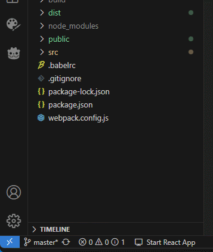

## Start React Server - A Visual Studio Code Extension
A simple extension so I don't have to open a terminal and type 'npm start' every time i want to run a dev server :D

Simply click on this icon in the bottom right corner to start your React App. Click again to close the server or close VS Code and the app server will close.

### Installation Steps
Install through your Visual Studio Code application.

Go to the sidebar and select 'Extensions' -> Select the 'Views and More Actions' button at the top-right (the three dots) -> Select "Install From VSIX..." -> Select release file.
